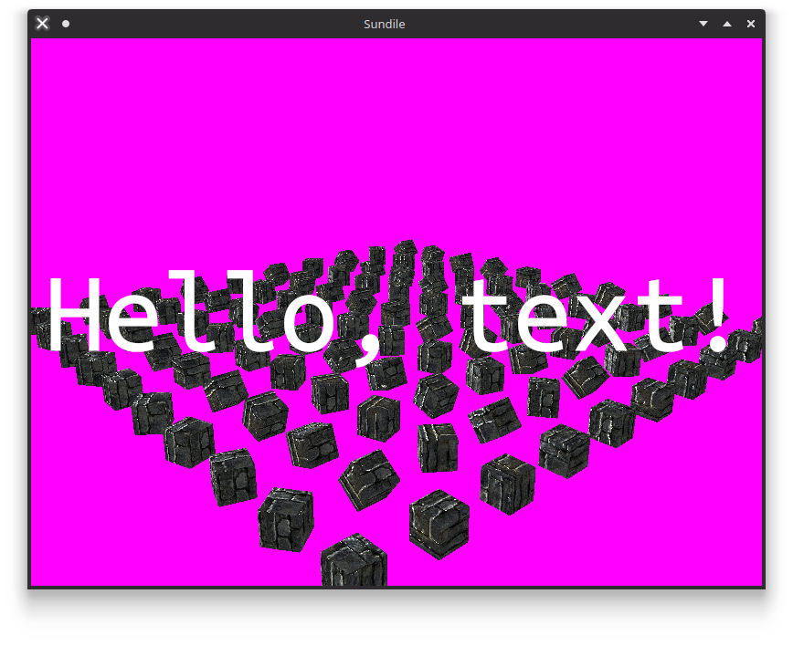

# sundile_rs

Sundile is a rendering engine written in Rust. It utilizes WGPU as its graphics backend and is WASM compatible.

__Live examples are available [on my website.](https://cubething.dev/gfx)__

## Features

- Asset creation and importing
- Model rendering
- Quad rendering
- Text rendering
- Shader support
- Native builds
- Exports to WASM (runs in the browser)

## WIP

- Clippy linting - Most of this is old code! I've learned a lot since then, but may not have the time to update it all.
- Multithreading - core crate overhaul
- Models only support diffuse and specular textures for now
- Need to integrate with an ECS
